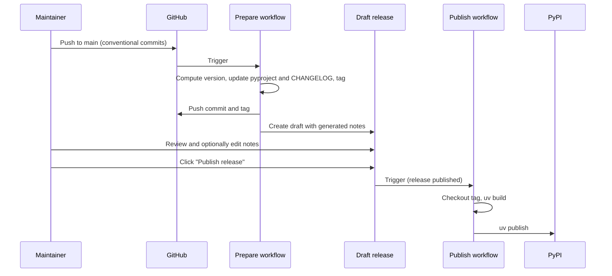

# Releasing

This document describes how releases work and what maintainers do for each release.

## How it works

Releasing is split into two phases:

In more detail:

1. **Prepare (automatic)**
   When you merge PRs into `main` (or push commits directly), the [Prepare release](.github/workflows/prepare-release.yml) workflow runs. It:
   - Reads [conventional commits](https://www.conventionalcommits.org/) on `main` since the last tag
   - Computes the next [semantic version](https://semver.org/) and writes it to `pyproject.toml` and `src/opentelemetry_instrumentation_re/version.py` (no manual version bump needed)
   - Updates `CHANGELOG.md` and creates a new git tag (e.g. `v0.2.0`)
   - Pushes the version commit and tag to `main`
   - Creates a **draft** GitHub release for that tag with **generated release notes** (from the changelog)

   The trigger is always **push or merge to `main`**; you never edit the version by hand for a release.

   **Nothing is published to PyPI at this stage.** The release exists only as a draft on GitHub.

2. **Publish (manual trigger)**
   When you are happy with the draft:
   - Open the [Releases](https://github.com/nilox94/opentelemetry-instrumentation-re/releases) page
   - Find the draft, review (and edit if needed) the release notes
   - Click **Publish release**

   That action triggers the [Publish](.github/workflows/publish.yml) workflow, which:
   - Checks out the release tag
   - Runs `uv build` to build the package
   - Runs `uv publish --trusted-publishing` to upload to PyPI

So: **version and release notes are automatic**; **publishing to PyPI happens only when you publish the draft**.

## What you do as a maintainer

### For each release

1. **Merge PRs to `main`** using conventional commit messages (e.g. `feat: add X`, `fix: Y`, `docs: Z`).
   See [CONTRIBUTING.md](CONTRIBUTING.md) for the format.

2. **Wait for CI** (Lint, Test) and for the **Prepare release** workflow to run.
   If there are new commits that warrant a version bump, a new tag and draft release will appear.

3. **Review the draft release** on the [Releases](https://github.com/nilox94/opentelemetry-instrumentation-re/releases) page:
   - Check the generated release notes
   - Edit the description if you want to add or change anything

4. **Publish the release** when ready: click **Publish release** on the draft.
   The **Publish** workflow will run and upload the package to PyPI.

### If you push but don't publish

- Each push to `main` that triggers a version bump creates a **new** tag and a **new** draft release.
- Older drafts (e.g. for `v0.2.0`) stay as drafts until you publish or delete them.
- The next run only considers commits **after** the latest tag, so release notes do not “accumulate” into one giant draft; you get one draft per version.

---

## Summary

Quick reference:

| Step | Who / when |
|------|-------------|
| Merge PRs with conventional commits to `main` | You (or collaborators) |
| Prepare workflow runs, creates tag + draft release with notes | Automatic |
| Review and optionally edit draft release notes | You |
| Click “Publish release” on the draft | You |
| Publish workflow runs, builds and uploads to PyPI | Automatic (triggered by publishing the draft) |
